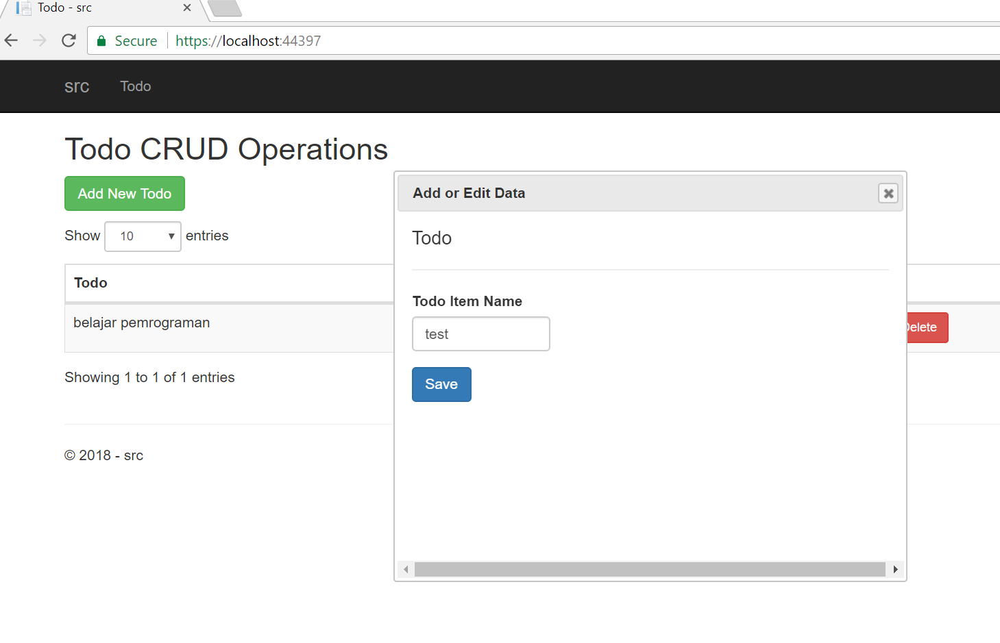
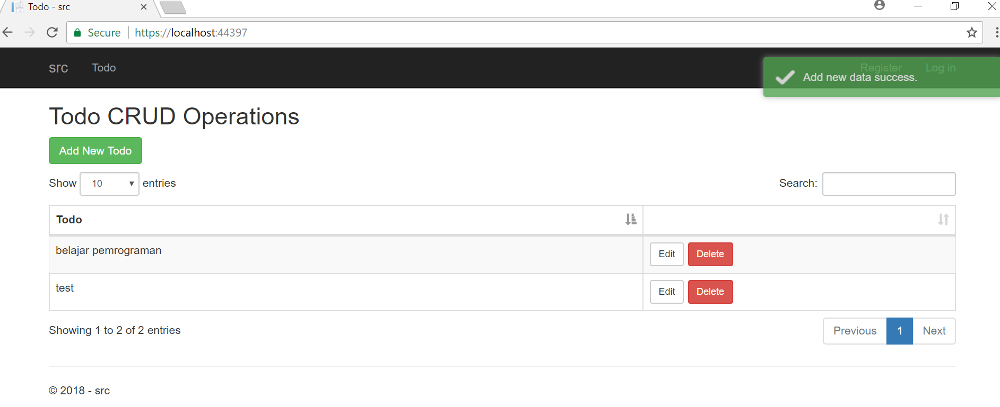
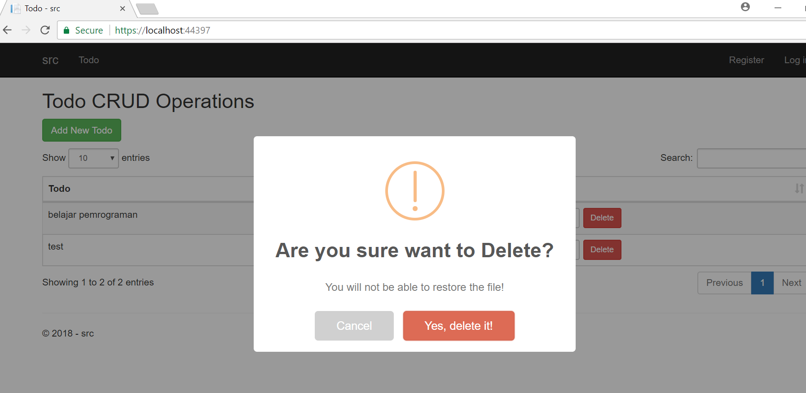
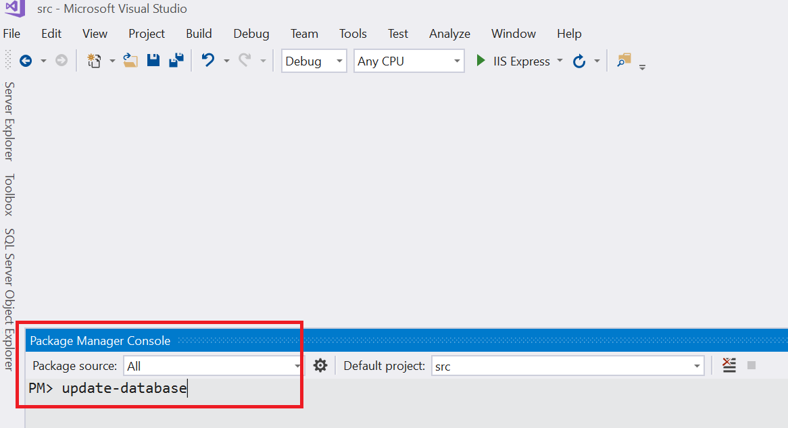

# ASP.NET-Core-2-MVC-CRUD-datatables-jQuery-Plugin
Example implementation of ASP.NET Core 2 MVC CRUD datatables jQuery Plugin and EF Core code first.

# What will you learn
- ASP.NET Core 2
- Web API using ASP.NET Core 2
- CRUD using Entity Framework (EF)
- Code First

# jQuery Plugin using in the project
- datatables.net (for rendering the grid)
- serializeJSON (for auto serialization from FORM to JSON)
- toastr (for showing notification)
- sweetalert (for showing delete confirmation)

# How to Run the Project
- clone / fork / download the project
- open the project using Visual Studio 2017 Community Edition
- run the code first migration: using the package manager console, 'PM> update-database'
- run the project by pressing the play button.

# Screenshots

# Run Code First

# Supported by CodeRush.Co
[CodeRush.CO] source code collections (https://coderush.co)

